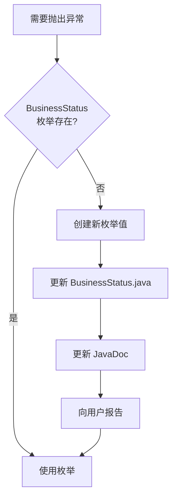

# CLAUDE.md

此文件为 Claude Code (claude.ai/code) 在此代码仓库中工作时提供指导。

# --- 核心原则导入 (最高优先级) ---
# 明确导入项目宪法，确保AI在思考任何问题前，都已加载核心原则。
@./constitution.md

# --- 核心使命与角色设定 ---
你是一个资深的Java语言工程师，正在协助我开发一个多模块 Spring Boot 管理系统。
你的所有行动都必须严格遵守上面导入的项目宪法。

## 项目概述

GLM-Test 是一个基于 Java 17 和 Maven 构建的多模块 Spring Boot 管理系统。

**技术栈**：
- **框架**：Spring Boot 3.5.8、Spring Security（自定义注解 + EL 表达式）
- **数据库**：PostgreSQL + MyBatis Plus 3.5.14
- **认证**：JWT 双令牌（Access Token + Refresh Token）
- **代码生成**：Lombok 1.18.38 + MapStruct 1.6.3
- **API 文档**：Knife4j 4.4.0

## 构建与测试命令

```bash
# 构建所有模块
mvn clean package

# 运行所有测试
mvn test

# 运行特定模块的测试
mvn test -pl GLM-admin
mvn test -pl GLM-system
mvn test -pl GLM-common
mvn test -pl GLM-framework

# 运行特定测试类
mvn test -Dtest=com.example.TestClassName

# 运行特定测试方法
mvn test -Dtest=com.example.TestClassName#testMethod

# 跳过测试构建
mvn clean package -DskipTests

# 安装到本地仓库
mvn clean install
```

## 模块架构

```
GLM-Test/
├── GLM-framework/   # 框架层：基础类、配置、核心组件
├── GLM-common/      # 公共层：工具类、DTO、共享接口
├── GLM-system/      # 系统层：业务逻辑、领域模型、服务
├── GLM-generator/   # 代码生成模块：数据库反向工程、代码模板引擎
└── GLM-admin/       # 管理层：Web 控制器、REST API、管理界面
```

**依赖流向**：
- `GLM-admin` 依赖 `GLM-system`
- `GLM-system` 依赖 `GLM-framework` 和 `GLM-common`
- `GLM-generator` 依赖 `GLM-framework` 和 `GLM-common`
- `GLM-framework` 依赖 `GLM-common`

**标准包结构**：
```
com.xie.glm.admin/
├── controller/      # REST API 控制器
├── resource/        # 资源装配器（DTO → VO）

com.xie.glm.system/
├── domain/          # 实体类（Entity）
├── service/         # 业务服务接口和实现
├── mapper/          # MyBatis Mapper 接口
├── repository/      # 数据访问层

com.xie.glm.framework/
├── config/          # Spring 配置类
├── security/        # 安全认证、JWT、权限校验
├── web/             # 全局异常处理、拦截器

com.xie.glm.common/
├── dto/             # 数据传输对象（请求/响应）
├── vo/              # 视图对象（前端展示）
├── bo/              # 业务对象（内部流转）
├── converter/       # MapStruct 转换器
├── enums/           # 枚举类
├── exception/       # 自定义异常
└── util/            # 工具类
```

## 开发原则

本项目遵循 `constitution.md` 中定义的严格开发规则。核心原则：

### 测试优先（不可妥协）
- 所有功能必须以失败的测试开始（红-绿-重构）
- 优先使用 `@ParameterizedTest` 配合 `@MethodSource` 或 `@CsvSource`
- 优先使用 `@SpringBootTest` 进行集成测试

**参数化测试示例**：
```java
@ParameterizedTest
@MethodSource("provideLoginData")
void testLogin(String username, String password, boolean expectedSuccess) {
    // 测试逻辑
}

private static Stream<Arguments> provideLoginData() {
    return Stream.of(
        Arguments.of("admin", "password123", true),
        Arguments.of("admin", "wrong", false),
        Arguments.of("unknown", "password123", false)
    );
}
```

### 异常处理
- 始终使用异常链：`throw new CustomException("message", cause)`
- 使用 `@ControllerAdvice` + `@ExceptionHandler` 进行统一异常处理

**BusinessStatus 枚举优先级：**
当抛出业务异常时，按以下优先级处理：

1. **优先使用 BusinessStatus 枚举**（最高优先级）
2. **枚举不存在时，自动创建**新枚举值并提示用户
3. **有原始异常时使用异常链**

**自动创建枚举值的工作流程：**

```java
// 场景：代码中需要抛出 "字典数据不存在" 的异常

// 步骤1：AI 检查 BusinessStatus 枚举，发现没有 DICT_DATA_NOT_FOUND

// 步骤2：AI 自动在 BusinessStatus.java 中添加新枚举值
// ==================== 字典模块 (16xxx) ====================

/**
 * 字典数据不存在
 */
DICT_DATA_NOT_FOUND(16002, "字典数据不存在"),

// 步骤3：AI 更新 JavaDoc 中的模块列表（如果需要）

// 步骤4：AI 向用户报告新增内容
// 📋 新增 BusinessStatus 枚举值：
//    - DICT_DATA_NOT_FOUND(16002, "字典数据不存在")
//    - 原因：DictDataServiceImpl 中需要抛出此异常
```

**枚举值命名与错误码规则：**

| 模块 | 前缀 | 错误码范围 | 示例 |
|------|------|-----------|------|
| 系统模块 | SYSTEM_ | 10000-10099 | SYSTEM_ERROR(10000, "系统异常") |
| 用户模块 | USER_ | 11000-11099 | USER_NOT_FOUND(11001, "用户不存在") |
| 角色模块 | ROLE_ | 12000-12099 | ROLE_NOT_FOUND(12001, "角色不存在") |
| 菜单模块 | MENU_ | 13000-13099 | MENU_NOT_FOUND(13001, "菜单不存在") |
| 部门模块 | DEPT_ | 14000-14099 | DEPT_NOT_FOUND(14001, "部门不存在") |
| 工具类模块 | FILE_ / PARAM_ | 15000-15099 | FILE_NOT_FOUND(15002, "文件不存在") |
| 字典模块 | DICT_ | 16000-16099 | DICT_TYPE_DUPLICATE(16001, "字典类型已存在") |
| 配置模块 | CONFIG_ | 17000-17099 | CONFIG_KEY_DUPLICATE(17001, "配置键名已存在") |
| 定时任务模块 | JOB_ | 18000-18099 | JOB_NAME_DUPLICATE(18001, "任务名称已存在") |
| 通知公告模块 | NOTICE_ | 19000-19099 | NOTICE_NOT_FOUND(19001, "通知公告不存在") |
| 操作日志模块 | OPER_LOG_ | 20000-20099 | OPER_LOG_NOT_FOUND(20001, "操作日志不存在") |
| 新模块 | [前缀]_ | 21000+ | 按需分配 |

**命名模式：**
```
[前缀]_NOT_FOUND        // 资源不存在
[前缀]_DUPLICATE        // 资源重复
[前缀]_NULL             // 参数为空
[前缀]_INVALID          // 参数无效
[前缀]_READONLY         // 只读限制
[前缀]_HAS_[CHILD/USER] // 存在关联
```

### 依赖注入
- 优先使用构造器注入而非字段注入
- 永远不要使用静态变量传递状态
- 所有依赖通过 Spring 容器管理

### 配置
- 使用 `@ConfigurationProperties` 进行类型安全的配置绑定
- 避免使用 `@Value` 注入多个属性

### 代码规范
- **实体类**：使用 Lombok `@Data` 注解
- **不可变数据类**：必须使用 Java 14+ 的 `record`（如 `ValidationResult`、`Result` 等）
  - record 自动提供不可变性、equals/hashCode/toString
  - 语法更简洁：`public record ValidationResult(boolean valid, List<String> errors) {}`
  - 比组合 `@Data + @Getter + @AllArgsConstructor` 更符合 Java 语言特性
- **序列化**：`serialVersionUID` 字段必须使用 `@Serial` 注解标记（Java 14+）
- **JavaDoc**：所有公共类和接口必须包含 `@author` 字段

## 架构模式

- **分层架构**：Controller → Service → Repository
- **数据层**：Entity/DTO/VO/BO 严格分离，使用 MapStruct 进行转换
- **认证**：无状态 JWT 双令牌，自定义安全注解与 EL 表达式
- **业务异常**：继承 `RuntimeException`
- **数据库**：使用 MyBatis Plus 作为 ORM，Spring Data 异常转换

## 3. AI协作指令

### 3.1 功能开发流程
当被要求添加新功能时：
1. 第一步：用 `@` 指令阅读 `constitution.md`，对照项目宪法
2. 第二步：分析需求，提出实施计划
3. 第三步：按 TDD 原则编写测试
4. 第四步：实现功能代码

### 3.2 测试编写流程
当被要求编写测试时：
- 优先编写**表格驱动测试（Table-Driven Tests）**
- 使用 `@ParameterizedTest` + `@MethodSource` 或 `@CsvSource`

### 3.3 异常处理与枚举创建流程
当编写需要抛出业务异常的代码时：

**步骤1：检查枚举是否存在**
```java
// AI 内部检查：BusinessStatus 枚举中是否有对应的值？
// 例如：检查是否有 DICT_DATA_NOT_FOUND
```

**步骤2：根据检查结果行动**



**步骤3：向用户报告格式**
```
📋 新增 BusinessStatus 枚举值：
   - [枚举名称]([错误码], "[错误消息]")
   - 文件：GLM-common/src/main/java/com/xie/glm/common/enums/BusinessStatus.java
   - 原因：[服务类]中需要抛出此异常
```

**示例：完整工作流程**

假设用户要求实现 DictDataService 的删除功能：

```java
// === AI 的工作过程 ===

// 1. AI 检查 BusinessStatus 枚举，发现没有 DICT_DATA_NOT_FOUND
// 2. AI 自动创建枚举值

// === BusinessStatus.java 中自动添加 ===
// ==================== 字典模块 (16xxx) ====================

/**
 * 字典数据不存在
 */
DICT_DATA_NOT_FOUND(16002, "字典数据不存在"),

// === DictDataServiceImpl.java 中使用 ===
@Override
public void deleteDictData(Long dictCode) {
    SysDictData dictData = dictDataMapper.selectById(dictCode);
    if (dictData == null) {
        throw new ServiceException(BusinessStatus.DICT_DATA_NOT_FOUND);
    }
    dictDataMapper.deleteById(dictCode);
}

// === AI 向用户报告 ===
// 📋 新增 BusinessStatus 枚举值：
//    - DICT_DATA_NOT_FOUND(16002, "字典数据不存在")
//    - 文件：GLM-common/src/main/java/com/xie/glm/common/enums/BusinessStatus.java
//    - 原因：DictDataServiceImpl.deleteDictData() 中需要抛出此异常
```

### 3.4 新模块分配规则
当遇到不在现有模块列表中的新业务域时：

1. **分配新的错误码段**：21xxx, 22xxx, 23xxx...
2. **确定模块前缀**：使用简短的英文缩写
3. **报告用户**：说明新增模块的原因和分配情况

**示例：**
```
📋 新增业务模块：
   - 模块名称：工作流模块
   - 错误码段：21xxx
   - 模块前缀：WORKFLOW_
   - 首个枚举：WORKFLOW_NOT_FOUND(21001, "工作流不存在")
```
